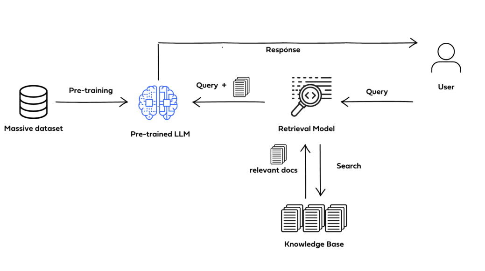

# H.O.L.M.E.S.
#### **H**istorical **O**bservation and **L**earning **M**aterials **E**ngineering **S**ystem
###### Version 1.0

The purpose of developing **H.O.L.M.E.S.** was based on a challenge inherent to  different business areas of a company, namely to have a "source of truth" where different types of information, technical or otherwise, can be consulted.

A challenge that naturally arises when seeking to develop an application like this (named **RAG - Retrieval Augmented Generation**) lies in choosing the models that will be part of the system architecture.

Not only is it relevant to be concerned about **Data Governance**, where the knowledge base will be stored and processed, but also the costs associated with maintaining the operation of a system with such value-generating capacity.

Initially, the choice was made for free open-source LLM models, also using vector storage libraries (Vector Stores)

Host: Ollama (Local)
LLM: llama3.2 (Meta)
Embeddings: llama3.2 (Meta)
Vector Store: FAISS (Meta)

---
###### *© Paulo Roberto de Sá Araújo, 2024*