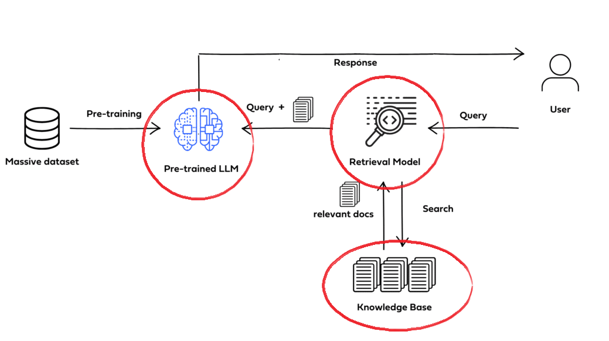

# H.O.L.M.E.S.
#### **H**istorical **O**bservation and **L**earning **M**aterials **E**ngineering **S**ystem
###### Version 1.0

The purpose of developing **H.O.L.M.E.S.** was based on a challenge inherent to  different business areas of a company, namely to have a "source of truth" where different types of information, technical or otherwise, can be consulted.

Using the principles of a **RAG (Retrieval-Augmented Generation)** software architecture, which combines generative neural network models with Documents that provide specific context, the system is capable of:
 

**1- Communicating with the user using Natural Language Processing  **
**2- Answering specific questions from a business area, as long as the model is fed with sufficient data sources in which it can search for the desired information.**
  

## How System Works

The user writes a question about a specific subject in the area in which he works, be it **internal regulations, acronyms, material information, information on purchasing documents, stock, orders, etc.**

The system identifies the subject addressed in the question, performs a similarity search in all knowledge bases - **structured and unstructured** - that were provided to it, feeds on relevant information to answer the question, and creates a response based on the user's question and the specific knowledge base.

Don't worry about "technical jargons", see below the system architecture to work just as it was described above.

A challenge that naturally arises when seeking to develop an application like this, lies in choosing the models that will be part of the system architecture.

Not only is it relevant to be concerned about **Data Governance**, **where the knowledge base will be stored and processed**, but also the **costs** associated with maintaining the operation of a system with such value-generating capacity.

Three of the components of the RAG architecture are the matter of our concern. These are the models/libraries: **LLM/Chat**, **Embeddings**, **Vector Store**.

Initially, the choice was made for **free open-source LLM models** running locally, also using vector storage libraries (Vector Stores) to save locally transformed data.

**Host: Ollama (Local)** 
**LLM: llama3.2 (Meta)** 
**Embeddings: llama3.2 (Meta)** 
**Vector Store: FAISS - Facebook AI Similarity Search (Meta)**

The system's user interface runs on a web application and once the address is accessed, the server will respond by directing to H.O.L.M.E.S. main page, the **Chat** page:

---
###### *© Paulo Roberto de Sá Araújo, 2024*